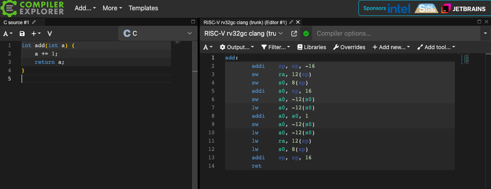

# 2. RISC-V 입문

✅ 이 프로젝트에서는 ISA로 RISC-V를 선택했고 그 이유는 다음과 같음

- 명세가 단순함
- x86, Arm 과 함께 최근 트렌디한 명령어 세트 아키텍쳐(ISA, Instruction Set Architecture)
- 문서화가 잘 되어 있고 읽기 편함

✅ 이 프로젝트에서는 32비트 RISC-V를 사용함

- ∵ 64비트 RISC-V 보다 간단하고 초심자 입장에서 부담이 적으므로

<br>

## 1. **QEMU virt machine**

✅ RISC-V 기반 QEMU의 `virt` 머신

- virt 머신 ≒ 컴퓨터(CPU, 메모리, 디스크 등)
- RISC-V 기반은 virt 머신의 CPU가 RISC-V ISA 명령어를 읽고 실행할 수 있음을 의미

✅ 이 책에서 QEMU의 `virt` 머신을 사용하는 이유

- 가상의 컴퓨터이지만, 실제 기기를 다루는 것과 같은 매우 흡사한 체험 가능
- QEMU 위에서 동작 → ∴ 기기 구매 없이 무료로 사용 가능
- QEMU 자체에 디버거를 연결해서 문제 확인 가능

<br>

## 2. **RISC-V 어셈블리 입문 가이드**

✅ RISC-V 어셈블리를 빠르게 익히는 방법 : C 코드가 어떤 어셈블리로 변환되는지 관찰하기

✅ 다음 항목은 어셈블리 입문에 필요한 개념

- 레지스터란 무엇인가
- 사칙연산 (`add`, `sub`, `mul`, `div` 등)
- 메모리 접근 (`lw`, `sw` 등)
- 분기 명령 (`beq`, `bne`, `blt`, `bgez` 등)
- 함수 호출
- 스택의 구조

💡 TIP : 온라인 컴파일러([**Compiler Explorer**](https://godbolt.org/))

- 어셈블리를 배울 때 유용한 온라인 컴파일러
- C 코드를 입력하면 컴파일 결과인 역어셈블리를 볼 수 있음
- 컴파일러 옵션으로  `-O0`(최적화 끔), `-O2`(최적화 레벨 2) 등을 지정해, 컴파일러가 어떤 어셈블리를 출력하는지 비교해보는 것도 공부에 도움이 됨
- RISC-V 어셈블리를 출력하려면 : **`RISC-V rv32gc clang (trunk)`**로 설정하기



<br>

### 2.1 **어셈블리 언어 기초**

✅ 어셈블리 언어는 기계어와 거의 1:1에 대응되는 표현임

🤖 어셈블리 언어 예시

```nasm
addi a0, a1, 123

# a1에 123을 더하고, 그 결과를 a0 레지스터에 저장
```

- `addi` : 즉시값(immediate)을 더한다
- `a0`, `a1`, `123` : 오퍼랜드

<br>

### **2.2 Registers (레지스터)**

✅ 레지스터

- CPU 내부의 임시 저장 공간
- 메모리보다 빠름
- CPU는 메모리에서 데이터를 레지스터로 읽어와서 연산 수행 후 결과를 다시 메모리/레지스터에 씀

✅ RISC-V에서 주로 쓰이는 레지스터

| **Register**      | **ABI Name (alias)**                      | **Description**   |
| ----------------- | ----------------------------------------- | ----------------- |
| `pc`              | `pc`                                      |
| (program counter) | 프로그램 카운터 (다음 실행할 명령어 주소) |
| `x0`              | `zero`                                    | 항상 0인 레지스터 |
| `x1`              | `ra`                                      |
| (return address)  | 함수 호출에서 복귀 주소 저장              |
| `x2`              | `sp`                                      |
| (stack pointer)   | 스택 포인터(스택의 최상단)                |
| `x5` - `x7`       | `t0` - `t2`                               |
| (temp)            | 임시용 레지스터 (임의 용도로 사용 가능)   |
| `x8`              | `fp`                                      |
| (frame pointer)   | 스택 프레임 포인터                        |
| `x10` - `x11`     | `a0` - `a1`                               |
| (argument)        | 함수 인자 및 반환값                       |
| `x12` - `x17`     | `a2` - `a7`                               | 함수 인자         |
| `x18` - `x27`     | `s0` - `s11`                              |
| (saved)           | 함수 호출 사이에도 값이 보존되는 레지스터 |
| `x28` - `x31`     | `t3` - `t6`                               | 임시용 레지스터   |

<br>

### 2.3 **Memory access (메모리 접근)**

✅ 레지스터와 메모리

- 레지스터는 속도가 빠르지만 개수가 제한되어 있음
- 메모리는 속도는 느리지만 용량은 훨씬 큼
- ∴ 자주 사용하는 값은 레지스터에 저장하고, 많은 양의 데이터는 메모리에 저장
- `lw`, `sw`는 레지스터 ↔ 메모리 간 데이터를 주고 받는 명령어

✅ `lw` : 메모리에서 값 읽기

```nasm
lw a0, (a1)
```

- 메모리에서 `a1`이 가리키는 주소의 4바이트 값을 가져와 a0 레지스터에 저장

✅ `sw`: 메모리에 값 저장

```nasm
sw a0, (a1)
```

- `a0` 레지스터의 값을 `a1`이 가리키는 메모리 주소에 저장

<br>

### 2.4 **Branch instructions (분기 명령)**

✅ 분기 명령

- 프로그램의 흐름을 제어하는 명령어
- C의 if, while, for 구문을 구현할 때 사용

✅ RISC-V의 분기 명령어

| 명령어 | 의미                           |
| ------ | ------------------------------ |
| `bnez` | 0이 아니면 분기                |
| `beq`  | 두 레지스터의 값이 같으면 분기 |
| `blt`  | 값이 작으면 분기               |

✅ 예시

```nasm
bnez a0, label
# a0가 0이 아니면 label로 점프
# a0가 0이면 아래 코드를 실행
```

<br>

### 2.5 **Function calls (함수 호출)**

✅ `jal` : 함수 호출 명령어

- jump and link

✅ `ret` : 복귀 명령어

✅ 호출 규약

- 함수 인자는 `a0` - `a7` 레지스터에 전달됨
- 반환 값은 `a0` 레지스터에 저장됨

✅ 예시

```nasm
li  a0, 123    // 인자 준비: 123을 a0 레지스터에 저장 (함수 인자),
jal ra, func   //  func(a0=123) 호출 -> ra에 복귀 주소 저장
               // 여기서 함수 func가 끝나서 돌아오면, 결과값은 a0에 저장되어 있음

func:
    addi a0, a0, 1  // a0에 1을 더함
    ret             // ra 레지스터로 복귀

```

```c
// 위 함수의 c언어 예시
int func(int a) {
    a += 1;
    return a;
}
```

### 2.6 **Stack (스택)**

✅ Stack

- 함수 호출과 로컬 변수를 위해 사용되는 LIFO 구조
- `sp`(stack pointer) : 스택 최상단을 가리킴
- 스택은 위에서 아래로 확장됨

✅ 예시

```nasm
addi sp, sp, -4  // 스택을 4바이트만큼 확장(아래로 확장)
sw   a0, (sp)    // sp가 가리키는 위치에 a0 저장

lw   a0, (sp)    // 다시 읽고
addi sp, sp, 4   // 스택을 원래대로 복원
```

💡 TIP

- C 언어로 코드를 작성하면, 컴파일러가 자동으로 스택을 할당/해제하므로 보통 이런 로우레벨 코드를 직접 작성할 일은 많지 않음

<br>

## 3. **CPU 모드**

✅ CPU에는 3가지 특권 수준이 있음

| **Mode** | **Overview** |
| -------- | ------------ |

| M-mode
(Machine Mode) | OpenSBI(일종의 펌웨어)나 부트로더 등 |
| S-mode
(Supervisor Mode) | 운영체제 커널이 동작하는 모드. "kernal mode" 라고 부름 |
| U-mode
(User Mode) | 일반 애플리케이션이 동작하는 모드. "user mode" 라고 부름 |

✅ 수준 비교

- M > S > U

<br>

## 4. **Privileged instructions (특권 명령)**

✅ 특권 명령

- 애플리케이션(U-Mode)에서 실행할 수 없는 명령
- S-mode나 M-mode에서 실행 가능함

✅ RISC-V의 특권 명령 예시

| Opcode and operands | Overview                                 | Pseudocode                       |
| ------------------- | ---------------------------------------- | -------------------------------- |
| `csrr rd, csr`      | CSR 값을 rd에 읽어옴                     | `rd = csr;`                      |
| `csrw csr, rs`      | rs의 값을 CSR에 씀                       | `csr = rs;`                      |
| `csrrw rd, csr, rs` | CSR 값을 읽고 쓰는 과정을 한 번에 수행   | `tmp = csr; csr = rs; rd = tmp;` |
| `sret`              | 트랩 핸들러 복귀(PC, 모드 등 복원)       |                                  |
| `sfence.vma`        | TLB(Translation Lookaside Buffer) 초기화 |                                  |

✅ CSR (Control and Status Register)

- CPU 내부 상태와 제어를 담당하는 레지스터
- 전체 목록은 [**RISC-V Privileged Specification**](https://riscv.org/specifications/privileged-isa/) 에서 확인 가능

💡 TIP

- `sret`같은 명령은 내부적으로 PC 수정, 모드 변경 등 복잡한 과정을 수행
- 실제 동작을 이해하려면 [rvemu](https://github.com/d0iasm/rvemu) 같은 간단한 RISC-V 에뮬레이터의 소스 코드를 참고
- (e.g. [sret implementation](https://github.com/d0iasm/rvemu/blob/f55eb5b376f22a73c0cf2630848c03f8d5c93922/src/cpu.rs#L3357-L3400))

<br>

## 5. **Inline assembly (인라인 어셈블리)**

✅ 인라인 어셈블리

- ex. 프로젝트 후반부에, C 코드 중간에 RISC-V 어셈블리를 직접 삽입하는 예시가 있음
- 별도의 .S 파일을 만드는 아래 구조와 같은 형태로 작성
- C 변수와 어셈블리 명령을 긴밀히 연결할 수 있고, 레지스터 할당·저장/복원을 컴파일러가 맡아주므로 편리

✅ 인라인 어셈블리 구조

```c
__asm__ __volatile__("assembly code"
                     : output operands
                     : input operands
                     : clobbered registers);
```

| **Part**            | **Description**                                                              |
| ------------------- | ---------------------------------------------------------------------------- |
| `__asm__`           | “이 코드는 인라인 어셈블리다”라고 컴파일러에게 알림                          |
| `__volatile__`      | 컴파일러에게 해당 "assembly" 코드를 최적화로 제거하거나 변경하지 말라고 지시 |
| `"assembly"`        | 실제 어셈블리 코드를 문자열 리터럴 형태로 작성                               |
| output operands     | 어셈블리가 실행된 뒤 결과를 저장할 C 변수(혹은 메모리 위치)를 지정           |
| input operands      | 어셈블리 코드에서 참조할 C 언어 표현식(예: 상수 123, 변수 x 등)을 지정       |
| clobbered registers | 어셈블리 내부에서 덮어써서 “내용이 파괴될 수 있는” 레지스터를 지정.          |

✅ 인라인 어셈블리에서 입력과 출력의 연결

```c
__asm__ __volatile__("어셈블리 코드" : 출력 오퍼랜드 : 입력 오퍼랜드);
```

| 역할          | 의미               | 예시 제약     | 설명                              |
| ------------- | ------------------ | ------------- | --------------------------------- |
| 출력 오퍼랜드 | 결과를 받을 변수   | `"=r"(value)` | `value` 변수에 레지스터 값을 저장 |
| 입력 오퍼랜드 | 어셈블리에서 쓸 값 | `"r"(123)`    | `123`을 레지스터에 담아 전달      |

- `"r"`: "register"의 약자, 레지스터에 담겠다는 뜻
- `"=r"`: `=`가 붙으면 출력용이라는 뜻

👉 어셈블리 코드 안에서 숫자 `%0`, `%1`의 의미

- 오퍼랜드가 몇 번째인지 나타내는 번호
- `%0` : 첫 번째 오퍼랜드
- `%1` : 두 번째 오퍼랜드
- 예시

```c
uint32_t out;
uint32_t in = 5;
__asm__ __volatile__("add %0, %1, %1" : "=r"(out) : "r"(in));
```

→ `%0` : 첫 번째 오퍼랜드(출력)

→ `%1` : 두 번째 오퍼랜드(입력)

🤖 예제 1: CSR에서 값 읽기

```c
uint32_t value;
__asm__ __volatile__("csrr %0, sepc" : "=r"(value));
```

- `csrr`: CSR 레지스터에서 값 읽기
- `"=r"(value)` : value에 %0의 값을 저장
- ∴ `"csrr %0, sepc"` : `sepc` 레지스터 값을 읽어와서 변수 `value`에 저장

🤖 예제 2: CSR에 값 쓰기

```c
__asm__ __volatile__("csrw sscratch, %0" : : "r"(123));
```

- `csrw`: CSR 레지스터에 값 쓰기
- `"r"(123)` : `123`이라는 값을 어셈블리에서 사용할 수 있게 레지스터에 넣기(입력)
- `“csrw sscratch, %0"` : `123`의 값을 레지스터 `sscratch`에 쓰기
