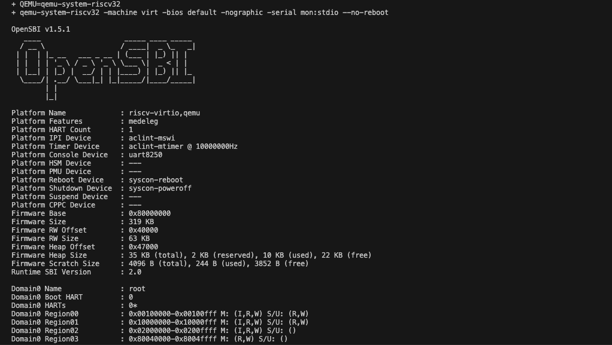
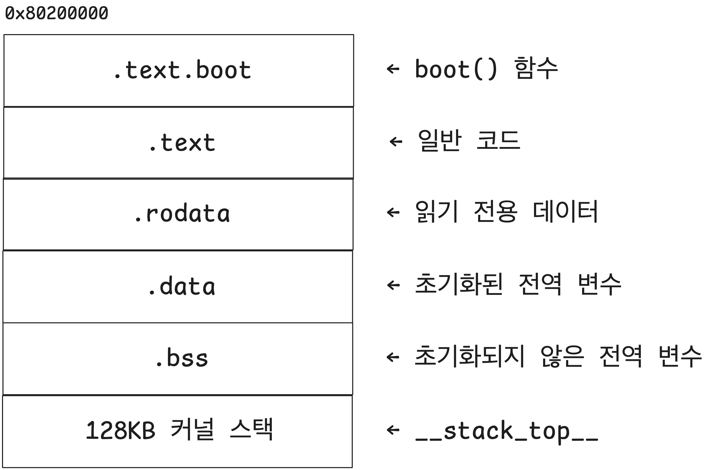

# 4. 커널 부팅 과정

✅ 부팅 과정 (QEMU + OpenSBI + RISC-V OS)

1. virt 머신 실행 시작

2. OpenSBI 실행

3. OS 시작(`kernel.c` 코드 진입)

4. OS 초기화 및 응용 프로그램 실행

👉 2. OpenSBI 실행

- M-mode에서 실행됨
- HW 초기화(CPU가 OS를 실행할 수 있을 정도의 기본 초기화)
- 디스크에서 커널을 메모리로 로드
- mret 명령어 실행(S-mode로 변경)

👉 3. OS 시작(`kernel.c` 코드 진입)

- OS가 자기 자신을 초기화함

👉 4. OS 초기화 및 응용 프로그램 실행

- S-mode에서 실행됨
- HW 초기화(OS가 사용할 HW 초기화 → ex. 가상 메모리 활성화 등)
- 프로세스 관리, 메모리 관리, 시스템 콜 초기화 등

✅ OS 프로젝트와 실제 OS의 부팅 과정 비교

| **단계** | **QEMU + OpenSBI + RISC-V OS**                               | **일반적인 PC OS (x86 기준)**                          |
| -------- | ------------------------------------------------------------ | ------------------------------------------------------ |
| 1        | virt 머신 실행 시작                                          | 컴퓨터 전원 ON                                         |
| 2        | OpenSBI 실행                                                 | BIOS/UEFI 실행                                         |
| 3        | OS 시작(kernel.c 코드 진입)                                  | 부트로더가 OS 커널 로드 후 실행                        |
| 4        | OS 초기화 및 사용자 앱 실행 (가상 메모리, 시스템 콜 등 설정) | OS 초기화 및 사용자 환경 구성 (서비스 시작, 로그인 등) |

## **1. 슈퍼바이저 바이너리 인터페이스 (SBI, Supervisor Binary Interface)**

✅ SBI

- 펌웨어 API 스팩 문서
- 펌웨어가 OS에게 제공하는 기능을 정의한 것
- OS 커널을 위한 API

✅ OpenSBI

- 가장 널리 사용되는 SBI 구현체 → 펌웨어
- QEMU에서 virt 머신을 실행하면 → 기본적으로 OpenSBI가 먼저 구동되어 HW 초기화 → 이후 커널 실행

## **2. OpenSBI 부팅해보기**

🤖 `run.sh` 스크립트 생성

```bash
$ touch run.sh     # run.sh 빈 파일 생성
$ chmod +x run.sh  # run.sh 파일에 실행권한(x) 추가
```

```bash
#!/bin/bash
set -xue

# QEMU 실행 파일 경로
QEMU=qemu-system-riscv32

# QEMU 실행
$QEMU -machine virt -bios default -nographic -serial mon:stdio --no-reboot
```

✅ run.sh에서 사용한 QEMU 옵션

- `-machine virt` : `virt` 머신 시작하기
- `-bios default` : QEMU가 제공하는 default 펌웨어(OpenSBI) 사용
- `-nographic` : GUI 없이 QEMU 실행하기
- `-serial mon:stdio` : QEMU의 표준 입출력을 `virt` 머신의 시리얼 포트에 연결하기
- `--no-reboot` : `virt` 머신이 크래시되면 재부팅하지 않고 종료 → 디버깅 시에 편리함

💡 **TIP**

- macOS에서 Homebrew 버전의 QEMU 파일 경로 확인 명령어

```bash
$ ls $(brew --prefix)/bin/qemu-system-riscv32

# /opt/homebrew/bin/qemu-system-riscv32
```

🤖 `run.sh` 스크립트 실행하기

```bash
$ ./run.sh
```



🪜 현재까지 진행 상황

| **항목**                | **설명**                     |
| ----------------------- | ---------------------------- |
| QEMU 설치               | Homebrew로 설치              |
| virt 머신 구동          | run.sh                       |
| OpenSBI 실행            | [run.sh](http://run.sh) 옵션 |
| virt 머신의 기본 펌웨어 |
| 커널 실행               | ❌ : 아직 커널은 없음        |

✅ OpenSBI가 출력한 정보 살펴보기

| 항목                               | 구분                | 설명                                                     |
| ---------------------------------- | ------------------- | -------------------------------------------------------- |
| `OpenSBI v1.5.1`                   | OpenSBI 실행 확인   | OpenSBI 펌웨어가 정상적으로 실행됨                       |
| `Platform Name: riscv-virtio,qemu` | 플랫폼 정보         | QEMU의 virt 머신 위에서 실행되고 있음                    |
| `Platform HART Count: 1`           | HART 수             | CPU 코어 개수 : 1개(단일 코어 시스템)                    |
| `Firmware Base: 0x80000000`        | 펌웨어 메모리 주소  | 펌웨어가 메모리에 올라간 위치(커널도 이 근처에서 실행됨) |
| `Runtime SBI Version: 2.0`         | SBI 인터페이스 버전 | 커널이 SBI 호출 시 사용하는 인터페이스 버전              |

| `Domain0 Next Address: 0x00000000
Domain0 Next Mode: S-mode` | 다음 실행 대상 | OpenSBI가 다음으로 넘길 주소가 설정되지 않음 → 커널이 아직 없음 |
| `Boot HART Base ISA: rv32imafdch` | ISA 정보 | 현재 사용 중인 명령어 세트(32비트 RISC-V + 확장 기능 포함) |

✅ 현재는 입력에 대한 동작이 없음

- OpenSBI에서 입력을 처리하는 루틴이 없음 → ∴ 아무 키를 눌러도 반응이 없음

✅ QEMU 종료하기

- `Ctrl + a`를 누른 후 `c`를 눌러 QEMU 모니터(QEMU 디버그 콘솔)로 전환
- `q` 명령으로 QEMU 종료

```bash
# QEMU 모니터
QEMU 10.0.0 monitor - type 'help' for more information
(qemu)
```

💡 TIP : QEMU 관련 명령어

```bash
C-a h    도움말 표시
C-a x    에뮬레이터 종료
C-a s    디스크 데이터를 파일에 저장(-snapshot 사용 시)
C-a t    콘솔 타임스탬프 토글
C-a b    break(매직 sysrq)
C-a c    콘솔과 모니터 간 전환
C-a C-a  C-a를 전송
```

## **3. 링커 스크립트(Linker Script)**

✅ 링커 스크립트

- 실행 파일(`.elf`)의 메모리 배치를 정의하는 파일
- 확장자 : `.ld`
- 링커는 이 정보를 바탕으로 함수와 변수가 배치될 메모리 주소를 결정

🤖 `kernel.ld` 파일

```c
ENTRY(boot)

SECTIONS {
    . = 0x80200000;

    .text :{
        KEEP(*(.text.boot));
        *(.text .text.*);
    }

    .rodata : ALIGN(4) {
        *(.rodata .rodata.*);
    }

    .data : ALIGN(4) {
        *(.data .data.*);
    }

    .bss : ALIGN(4) {
        __bss = .;
        *(.bss .bss.* .sbss .sbss.*);
        __bss_end = .;
    }

		/* 스택 설정 */
    . = ALIGN(4);
    . += 128 * 1024; /* 128KB */
    __stack_top = .;
}
```

✅ `kernel.ld` 주요 포인트

- `boot` 함수를 엔트리 포인트로 지정
- 베이스 주소(base address)는 `0x80200000`으로 설정
- `.text.boot` 섹션을 가장 앞에 둡니다.
- 각 섹션을 `.text`, `.rodata`, `.data`, `.bss`. 순서대로 배치
- `.bss` 이후에 커널 스택을 배치하고, 크기는 128KB로 설정

👉 `ENTRY(boot)` : 커널 진입점 지정

- 즉, 커널이 실행되면 `boot()` 함수부터 시작됨

👉 `. = 0x80200000;` : 시작 주소 지정(Base address)

- 커널 코드가 메모리 상에서 `0x80200000` 주소부터 배치됨
- virt 머신의 메모리 안에서 커널이 로드되는 위치
- OpenSBI가 커널에 제어권을 넘기면(`mret`) → 이 주소를 기준으로 커널이 실행됨

👉 `.text` 섹션 : 코드 섹션 배치

- `boot()` 함수는 .text 섹션 안에 있음 → ∴ 이를 가장 먼저 배치

👉 `.rodata` 섹션 : 읽기 전용 데이터 배치

- ex. 문자열 상수, 전역 const 등

👉 `.data` 섹션 : 초기화된 전역 변수

👉 `.bss` 섹션 : 초기화되지 않은 전역 변수

👉 스택 설정

- 128KB 커널 스택 공간 확보 후 → 스택 포인터 지정
- `__stack_top`이라는 심볼이 커널 시작 시 스택 포인터로 사용됨



## **4. 최소화된 커널**

🤖 `kernel.c 파일` 생성

```c
typedef unsigned char uint8_t;
typedef unsigned int uint32_t;
typedef uint32_t size_t;

extern char __bss[], __bss_end[], __stack_top[];

void *memset(void *buf, char c, size_t n) {
    uint8_t *p = (uint8_t *) buf;
    while (n--)
        *p++ = c;
    return buf;
}

void kernel_main(void) {
    memset(__bss, 0, (size_t) __bss_end - (size_t) __bss);

    for (;;);
}

__attribute__((section(".text.boot")))
__attribute__((naked))
void boot(void) {
    __asm__ __volatile__(
        "mv sp, %[stack_top]\n" // Set the stack pointer
        "j kernel_main\n"       // Jump to the kernel main function
        :
        : [stack_top] "r" (__stack_top) // Pass the stack top address as %[stack_top]
    );
}
```

✅ 커널 진입점 (Kernel entry point)

- 커널을 실행하면 `boot()` 함수에서 시작함 → ∵ 링커 스크립트에서 `Entry(boot)`

✅ `boot()` 함수 동작

- 링커스크립트에서 정의한 스택 끝 주소를 스택 포인터(`sp`)에 대입
- `kernel_main` 으로 점프
- RISC-V에서 스택은 내려가는 방향으로 커지므로, 스택의 최상위 주소(`stack_top`)가 스택의 끝 주소

✅ `boot` 함수 속성

1. `__attribute__((naked))` : 함수 시작과 끝에서 컴파일러가 추가로 생성하는 코드(프롤로그, 에필로그 등)를 생략

2. `__attribute__((section(".text.boot")))`: `.text.boot` 섹션에 이 함수를 배치

- OpenSBI는 펌웨어 작업 이후 `0x80200000` 주소로 점프만 하므로, `boot` 함수를 해당 주소에 명시적으로 배치해야함

✅ 링커 스크립트 심볼 (`extern char`)

- 해당 심볼이 가리키는 주소가 필요하므로 선언한 것

✅ `kernel_main` 함수

- `.bss` 섹션을 0으로 초기화
- 이렇게 수동으로 초기화하는 것이 안전함
- 이후 무한 루프에 진입 → 커널이 종료되지 않도록

## **5. 실행해보기**

🤖 `run.sh` 수정

```bash
#!/bin/bash
set -xue

QEMU=qemu-system-riscv32

# clang 경로와 컴파일 옵션
CC=/opt/homebrew/opt/llvm/bin/clang  # Ubuntu 등 환경에 따라 경로 조정: CC=clang
CFLAGS="-std=c11 -O2 -g3 -Wall -Wextra --target=riscv32-unknown-elf -fno-stack-protector -ffreestanding -nostdlib"

# 커널 빌드
$CC $CFLAGS -Wl,-Tkernel.ld -Wl,-Map=kernel.map -o kernel.elf \
    kernel.c

# QEMU 실행
$QEMU -machine virt -bios default -nographic -serial mon:stdio --no-reboot \
    -kernel kernel.elf
```

✅ `CFLAGS`에 지정한 옵션의 의미

| **옵션**                       | **설명**                                                                                                                           | **참고** |
| ------------------------------ | ---------------------------------------------------------------------------------------------------------------------------------- | -------- |
| `-std=c11`                     | C11 표준 사용                                                                                                                      |          |
| `-O2`                          | 최적화 레벨 2 설정                                                                                                                 |          |
| `-g3`                          | 최대한의 디버그 정보 생성                                                                                                          |          |
| `-Wall`                        | 핵심 경고 활성화                                                                                                                   |          |
| `-Wextra`                      | 추가 경고 활성화                                                                                                                   |          |
| `--target=riscv32-unknown-elf` | 32비트 RISC-V 대상 아키텍처로 컴파일                                                                                               |          |
| `-fno-stack-protector`         | 스택 보호 기능 비활성화 ([**#31**](https://github.com/nuta/operating-system-in-1000-lines/issues/31#issuecomment-2613219393) 참고) |          |
| `-ffreestanding`               | 호스트(개발 환경) 표준 라이브러리를 사용하지 않음                                                                                  |          |
| `-nostdlib`                    | 표준 라이브러리를 링크하지 않음                                                                                                    |          |
| `-Wl,-Tkernel.ld`              | 링커 스크립트(`kernel.ld`) 지정                                                                                                    |          |
| `-Wl,-Map=kernel.map`          | 맵 파일(`kernel.map`) 생성 (링킹 결과와 섹션 배치를 확인할 수 있음)                                                                |          |

- `Wl,`는 링커 옵션을 직접 전달하는 방법
- `clang`은 내부적으로 링커를 실행하므로 링커 스크립트를 지정해줘야함

## **6. 첫 번째 커널 디버깅**

✅ run.sh를 실행하면 커널은 kernel_main()에서 무한 루프에 들어감

- 화면으로는 별다른 변화가 없어 보일 수 있음
- QEMU의 디버그 기능을 사용해 코드가 어디까지 실행되었는지 확인 가능

🤖 QEMU 모니터에서 CPU 레지스터 정보 확인하기

```bash
QEMU 10.0.0 monitor - type 'help' for more information
(qemu) info registers
```

```bash

CPU#0
 V      =   0
 pc       80200048
 mhartid  00000000
 mstatus  80006080
 mstatush 00000000
 hstatus  00000000
 vsstatus 00000000
 mip      00000000
 mie      00000008
 mideleg  00001666
 hideleg  00000000
 medeleg  00f0b509
 hedeleg  00000000
 mtvec    800004e0
 stvec    80200000
 vstvec   00000000
 mepc     80200000
 sepc     00000000
 vsepc    00000000
 mcause   00000003
 scause   00000000
 vscause  00000000
 mtval    80010724
 stval    00000000
 htval    00000000
 mtval2   00000000
 mscratch 80046000
 sscratch 00000000
 satp     00000000
 x0/zero  00000000 x1/ra    8000e63e x2/sp    8022004c x3/gp    00000000
 x4/tp    80046000 x5/t0    00000001 x6/t1    00000002 x7/t2    00001000
 x8/s0    80045f40 x9/s1    00000001 x10/a0   8020004c x11/a1   8020004c
 x12/a2   00000000 x13/a3   00000019 x14/a4   00000000 x15/a5   00000001
 x16/a6   00000001 x17/a7   00000005 x18/s2   80200000 x19/s3   00000000
 x20/s4   87e00000 x21/s5   00000000 x22/s6   80006800 x23/s7   00000001
 x24/s8   00002000 x25/s9   80042308 x26/s10  00000000 x27/s11  00000000
 x28/t3   80020ad1 x29/t4   80045f40 x30/t5   0000006c x31/t6   00000000
 fcsr     00000000
 f0/ft0   ffffffff00000000 f1/ft1   ffffffff00000000 f2/ft2   ffffffff00000000 f3/ft3   ffffffff00000000
 f4/ft4   ffffffff00000000 f5/ft5   ffffffff00000000 f6/ft6   ffffffff00000000 f7/ft7   ffffffff00000000
 f8/fs0   ffffffff00000000 f9/fs1   ffffffff00000000 f10/fa0  ffffffff00000000 f11/fa1  ffffffff00000000
 f12/fa2  ffffffff00000000 f13/fa3  ffffffff00000000 f14/fa4  ffffffff00000000 f15/fa5  ffffffff00000000
 f16/fa6  ffffffff00000000 f17/fa7  ffffffff00000000 f18/fs2  ffffffff00000000 f19/fs3  ffffffff00000000
 f20/fs4  ffffffff00000000 f21/fs5  ffffffff00000000 f22/fs6  ffffffff00000000 f23/fs7  ffffffff00000000
 f24/fs8  ffffffff00000000 f25/fs9  ffffffff00000000 f26/fs10 ffffffff00000000 f27/fs11 ffffffff00000000
 f28/ft8  ffffffff00000000 f29/ft9  ffffffff00000000 f30/ft10 ffffffff00000000 f31/ft11 ffffffff00000000
```

👉 `pc 80200048`

- 현재 0x80200048 주소의 명령어가 실행되고 있음을 의미

🤖 `kernel.elf` 파일을 디스어셈블(disassemble)하는 명령어

- 즉, 바이너리 파일에 담긴 기계어(16진수)를 사람이 읽을 수 있는 어셈블리 코드로 변환해서 보여줌

```bash
$ llvm-objdump -d kernel.elf
```

```bash
kernel.elf:     file format elf32-littleriscv

Disassembly of section .text:

80200000 <boot>:
80200000: 80220537      lui     a0, 0x80220
80200004: 04c50513      addi    a0, a0, 0x4c
80200008: 812a          mv      sp, a0
8020000a: 01a0006f      j       0x80200024 <kernel_main>

8020000e <memset>:
8020000e: ca11          beqz    a2, 0x80200022 <memset+0x14>
80200010: 962a          add     a2, a2, a0
80200012: 86aa          mv      a3, a0
80200014: 00168713      addi    a4, a3, 0x1
80200018: 00b68023      sb      a1, 0x0(a3)
8020001c: 86ba          mv      a3, a4
8020001e: fec71be3      bne     a4, a2, 0x80200014 <memset+0x6>
80200022: 8082          ret

80200024 <kernel_main>:
80200024: 802005b7      lui     a1, 0x80200
80200028: 04c58593      addi    a1, a1, 0x4c
8020002c: 80200537      lui     a0, 0x80200
80200030: 04c50513      addi    a0, a0, 0x4c
80200034: 40b50633      sub     a2, a0, a1
80200038: ca01          beqz    a2, 0x80200048 <kernel_main+0x24>
8020003a: 00158613      addi    a2, a1, 0x1
8020003e: 00058023      sb      zero, 0x0(a1)
80200042: 85b2          mv      a1, a2
80200044: fea61be3      bne     a2, a0, 0x8020003a <kernel_main+0x16>
80200048: a001          j       0x80200048 <kernel_main+0x24>
```

✅ `.elf` 파일을 디스어셈블하는 이유

- 링커가 정확히 원하는 주소에 코드를 배치했는지 확인
- `boot()`, `kernel_main()` 같은 중요 함수들이 어떤 주소에 있는지 확인
- 스택 포인터 설정이나 무한 루프 등이 어셈블리 상에서 의도대로 작성되었는지 확인

🤖 `boot()` 함수

- 스택 설정 뒤 → 커널로 진입

```c
80200000 <boot>:
80200000: 80220537      lui     a0, 0x80220
80200004: 04c50513      addi    a0, a0, 0x4c
80200008: 812a          mv      sp, a0    // sp값을 a0(8022004c)로 설정
8020000a: 01a0006f      j       0x80200024 <kernel_main> // kernel_main으로 점프
```

🤖 `kernel_main()` 함수

- `bss` 초기화 뒤 → 무한 루프 진입 확인

```c
80200024 <kernel_main>:
...
80200048: a001          j       0x80200048 <kernel_main+0x24>
```

🤖 `sp`가 `0x8022004c`로 설정되었는지 확인하기

- `kernel.map`

```c
...
8022004c 8022004c        0     1 __stack_top = .
...
```

- QEMU 레지스터 정보에서도 확인 가능

```
info register
...
x2/sp 8022004c
...
```

✅ 이를 통해 링커 스크립트, 빌드 결과, QEMU 상태가 모두 일관되게 동작함을 확인
