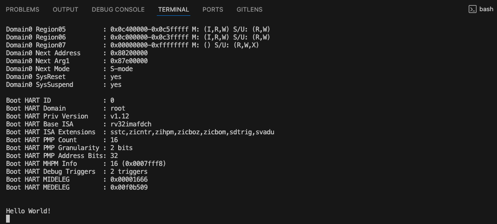
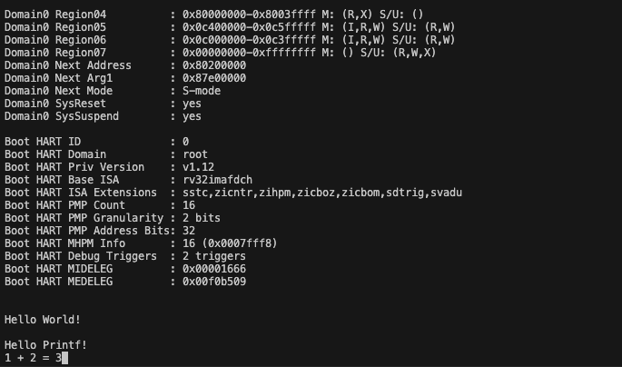

# 5. Hello World!

✅ 현재까지 진행 상황과 이번 챕터에서 목표

- 현재까지 커널을 부팅했음
- 이번 챕터에서는 커널에서 문자열을 직접 출력하면서 커널의 동작을 확인해보기

## **1. SBI에게 "hello"라고 말하기**

✅ SBI

- OS를 위한 API
- SBI를 커널이 호출하려면 `ecall` 명령어 사용

🤖 `kernel.c` 수정

- 커널에서 OpenSBI를 통해 문자열을 출력하는 기능이 추가됐음

```c
#include "kernel.h"

extern char __bss[], __bss_end[], __stack_top[];

struct sbiret sbi_call(long arg0, long arg1, long arg2, long arg3, long arg4,
                       long arg5, long fid, long eid) {
    register long a0 __asm__("a0") = arg0;
    register long a1 __asm__("a1") = arg1;
    register long a2 __asm__("a2") = arg2;
    register long a3 __asm__("a3") = arg3;
    register long a4 __asm__("a4") = arg4;
    register long a5 __asm__("a5") = arg5;
    register long a6 __asm__("a6") = fid;
    register long a7 __asm__("a7") = eid;

    __asm__ __volatile__("ecall"
                         : "=r"(a0), "=r"(a1)
                         : "r"(a0), "r"(a1), "r"(a2), "r"(a3), "r"(a4), "r"(a5),
                           "r"(a6), "r"(a7)
                         : "memory");
    return (struct sbiret){.error = a0, .value = a1};
}

void putchar(char ch) {
    sbi_call(ch, 0, 0, 0, 0, 0, 0, 1 /* Console Putchar */);
}

void kernel_main(void) {
    const char *s = "\n\nHello World!\n";
    for (int i = 0; s[i] != '\0'; i++) {
        putchar(s[i]);
    }

    for (;;) {
        __asm__ __volatile__("wfi");
    }
}
```

🤖 `kernel.h` 생성

```c
#pragma once

struct sbiret {
    long error;
    long value;
};
```

✅ `sbi_call` 함수의 역할

- SBI 호출을 위한 공통 함수
- RISC-V SBI 규약에 따라 OpenSBI에 기능 요청할 때 사용
- `ecall` 명령어로 S-모드(커널) → M-모드(OpenSBI)로 전환 후 기능 실행

✅ 호출 규약 요약

| 레지스터  | 역할               |
| --------- | ------------------ |
| `a0 ~ a5` | 함수 인자          |
| `a6`      | Function ID (FID)  |
| `a7`      | Extension ID (EID) |
| `a0`      | 반환값: 에러 코드  |
| `a1`      | 반환값: 실제 값    |

```c
struct sbiret {
    long error;
    long value;
};
```

- 반환값 : SBI 함수는 위 구조체처럼 `a0`, `a1`에 값을 담아 반환

✅ `register`, `__asm__("a0")` 의미

- C 변수와 레지스터 직접 바인딩
- 커널/시스템 콜에서 자주 사용하는 관용 표현

✅ 실행 흐름 요약

1. 커널에서 `sbi_call()` 실행 → `ecall` 발생
2. 실행 모드가 S-모드 → M-모드(OpenSBI)로 전환
3. OpenSBI가 요청된 기능 수행 (예: 문자 출력)
4. 다시 S-모드로 복귀 → 다음 명령부터 실행(현재 무한 루프)

### 📌 **직접 실행해보기**

✅ 이제 코드를 실행해보면, virt 머신이 구동되고 Hello World! 라는 메세지가 출력됨

```bash
$ ./ruh.sh
```



✅ Hello World! 메세지가 출력되는 과정

1️⃣ 커널에서 `ecall` 실행

- 커널 코드(`putchar()` → `sbi_call()` → `ecall`)가 실행됨
- CPU는 상위 권한인 M-모드로 전환됨

2️⃣ OpenSBI의 트랩 핸들러로 점프

- `mtvec` 레지스터에 등록된 M-모드 트랩 핸들러로 점프
- 내부적으로 C 함수 `sbi_trap_handler()`가 호출됨

3️⃣ Extension ID (`eid`)에 따라 처리 함수 결정

- `a7` 레지스터로 전달된 Extension ID (`eid = 1`)를 기준으로
- `sbi_console_putchar()` 함수 실행

4️⃣ UART 드라이버 호출

- `sbi_console_putchar()` 함수 내부에서 8250 UART 디바이스 드라이버 호출

5️⃣ QEMU가 문자 수신

- QEMU가 UART8250 에뮬레이션 장치를 통해 문자 수신
- 표준 출력(stdout)으로 해당 문자 전송

6️⃣ 터미널에 문자 표시

- 현재 사용 중인 터미널 에뮬레이터가 수신된 문자를 화면에 출력

## **2. `printf` 함수**

✅ 현재까지는 문자를 단순히 출력했음

- 이제 `printf` 함수를 만들 것

✅ printf 함수

- 포맷 문자열과, 그 안에 들어갈 값을 인자로 받아서 출력함

```c
printf("1 + 2 = %d", 1+2); // 1 + 2 = 3이 출력됨
```

- 여기서는 `%d(10진수), %x(16진수), %s(문자열)`만 지원하는 작은 버전의 printf를 생성
- 그리고 이 함수는 유저 프로그램에서도 사용할 예정이므로 `common.c`에 작성

🤖 `common.c` 파일 생성

```c
#include "common.h"

void putchar(char ch);

void printf(const char *fmt, ...) {
    va_list vargs;
    va_start(vargs, fmt);

    while (*fmt) {
        if (*fmt == '%') {
            fmt++; // Skip '%'
            switch (*fmt) { // Read the next character
                case '\0': // '%' at the end of the format string
                    putchar('%');
                    goto end;
                case '%': // Print '%'
                    putchar('%');
                    break;
                case 's': { // Print a NULL-terminated string.
                    const char *s = va_arg(vargs, const char *);
                    while (*s) {
                        putchar(*s);
                        s++;
                    }
                    break;
                }
                case 'd': { // Print an integer in decimal.
                    int value = va_arg(vargs, int);
                    unsigned magnitude = value; // https://github.com/nuta/operating-system-in-1000-lines/issues/64
                    if (value < 0) {
                        putchar('-');
                        magnitude = -magnitude;
                    }

                    unsigned divisor = 1;
                    while (magnitude / divisor > 9)
                        divisor *= 10;

                    while (divisor > 0) {
                        putchar('0' + magnitude / divisor);
                        magnitude %= divisor;
                        divisor /= 10;
                    }

                    break;
                }
                case 'x': { // Print an integer in hexadecimal.
                    unsigned value = va_arg(vargs, unsigned);
                    for (int i = 7; i >= 0; i--) {
                        unsigned nibble = (value >> (i * 4)) & 0xf;
                        putchar("0123456789abcdef"[nibble]);
                    }
                }
            }
        } else {
            putchar(*fmt);
        }

        fmt++;
    }

end:
    va_end(vargs);
}
```

🤖 `common.h` 생성

```c
#pragma once

#define va_list  __builtin_va_list
#define va_start __builtin_va_start
#define va_end   __builtin_va_end
#define va_arg   __builtin_va_arg

void printf(const char *fmt, ...);
```

🤖 `kernel.c` 에서 `printf()` 사용

```c
#include "kernel.h"
#include "common.h"

void kernel_main(void) {
    printf("\n\nHello %s\n", "World!");
    printf("1 + 2 = %d, %x\n", 1 + 2, 0x1234abcd);

    for (;;) {
        __asm__ __volatile__("wfi");
    }
}
```

- 그리고 `common.c`도 빌드 대상에 추가

```c
$CC $CFLAGS -Wl,-Tkernel.ld -Wl,-Map=kernel.map -o kernel.elf \
    kernel.c common.c
```

✅ 코드 동작 확인하기

```c
$ ./run.sh
```


